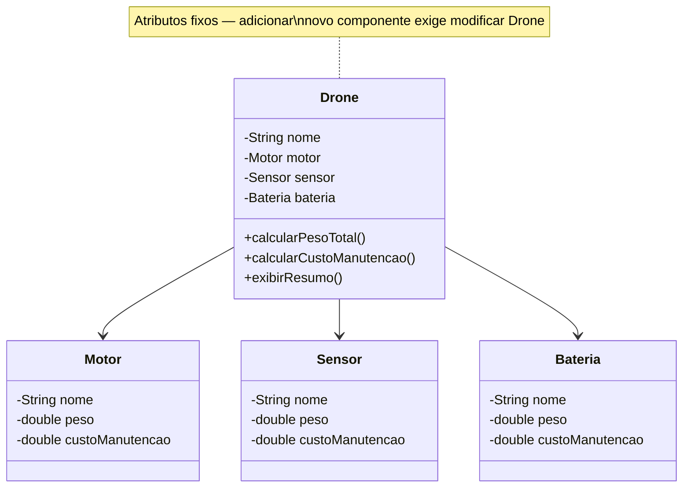
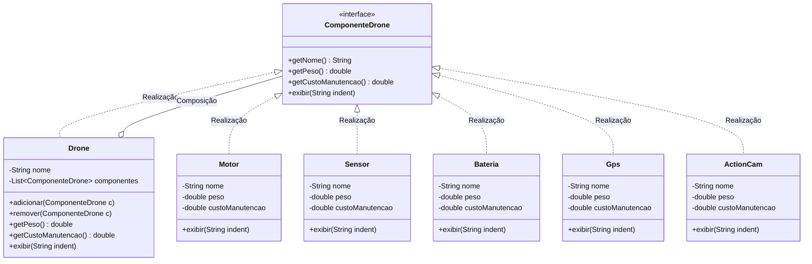

# Composite: Pattern and Anti-pattern

Este repositório contém um projeto acadêmico desenvolvido em Java para demonstrar, de forma prática e visual, a diferença entre o uso correto de um Padrão de Projeto (**Composite**) e a aplicação de um **Anti-padrão** (composição rígida com atributos fixos).

## 📌 Índice
* [1. O Cenário de Negócio](#1-o-cenário-de-negócio)
* [2. O Anti-padrão (Composição Rígida)](#2-o-anti-padrão-composição-rígida)
* [3. O Modelo Padrão (Composite Pattern)](#3-o-modelo-padrão-composite-pattern)
* [4. Visualização UML](#4-visualização-uml)
* [5. Principais Diferenças](#5-principais-diferenças)
* [6. Código Exemplo](#6-código-exemplo)
* [7. Como Executar](#7-como-executar)
* [📂 Ver código do Anti-padrão](./antipattern)
* [📂 Ver código do Padrão (Composite)](./pattern)

---

## 1. O Cenário de Negócio
O projeto simula um sistema de **montagem e manutenção de drones**. Um `Drone` é composto por peças individuais como `Motor`, `Sensor`, `Bateria`, `Gps` e `ActionCam`. O objetivo é calcular o **peso total** e o **custo total de manutenção** do drone, independentemente de quantos ou quais componentes ele possui.

---

## 2. O Anti-padrão (Composição Rígida)
No modelo anti-padrão, o `Drone` possui cada componente como um **atributo fixo e tipado** (`Motor motor`, `Sensor sensor`, `Bateria bateria`). Os métodos `calcularPesoTotal()` e `calcularCustoManutencao()` somam os valores **manualmente**, componente por componente.

**O Problema:** Se um novo componente precisar ser adicionado — como um `Gps` ou uma `ActionCam` — o programador precisa **modificar a classe `Drone`**: adicionar um novo atributo, atualizar o construtor e reescrever os métodos de cálculo. O `Drone` nunca está fechado para modificação.

---

## 3. O Modelo Padrão (Composite Pattern)
Para resolver a rigidez, criamos uma interface comum `ComponenteDrone` que tanto as peças individuais quanto o próprio `Drone` implementam. O `Drone` passa a ter uma **lista de `ComponenteDrone`** em vez de atributos fixos.

**A Solução:** Os métodos `getPeso()` e `getCustoManutencao()` percorrem a lista automaticamente. Adicionar um novo componente é apenas uma linha — `drone.adicionar(new Gps(...))` — sem nenhuma modificação na classe `Drone`. Objetos individuais e compostos são tratados de forma uniforme.

---

## 4. Visualização UML

Abaixo estão os diagramas refletindo a estrutura do código.

### ❌ UML do Anti-padrão


### ✅ UML do Padrão Composite


---

## 5. Principais Diferenças

| Característica | ❌ Anti-padrão (Composição Rígida) | ✅ Padrão Composite (Lista Dinâmica) |
| :--- | :--- | :--- |
| **Estrutura** | Atributos fixos e tipados no `Drone`. | Lista dinâmica de `ComponenteDrone`. |
| **Extensibilidade** | **Baixa:** Novo componente exige modificar `Drone`. | **Alta:** Basta criar nova classe e chamar `adicionar()`. |
| **Cálculo** | **Hardcoded:** soma manual componente por componente. | **Automático:** percorre a lista dinamicamente. |
| **Uniformidade** | Cada tipo tratado de forma diferente. | Todos os componentes tratados da mesma forma. |
| **SOLID** | Viola o *Open/Closed Principle* (OCP). | Segue o *Open/Closed Principle* (OCP). |

---

## 6. Código Exemplo

```java
// Criando componentes individuais
Motor motor = new Motor("Motor Principal", 0.8, 150.0);
Sensor sensor = new Sensor("Sensor de Proximidade", 0.2, 80.0);
Bateria bateria = new Bateria("Bateria LiPo", 0.5, 120.0);
Gps gps = new Gps("GPS", 0.1, 100.0);
ActionCam cam = new ActionCam("Action Camera", 0.3, 200.0);

// Montando o drone (Composite em ação)
Drone drone = new Drone("DJI Mavic");
drone.adicionar(motor);
drone.adicionar(sensor);
drone.adicionar(bateria);
drone.adicionar(gps);
drone.adicionar(cam);

drone.exibir("");
// Saída:
// === Drone: DJI Mavic ===
//   - Motor: Motor Principal | Peso: 0.8kg | Custo: R$150.0
//   - Sensor: Sensor de Proximidade | Peso: 0.2kg | Custo: R$80.0
//   ...
// Peso Total: 1,90 kg
// Custo Total de Manutenção: R$ 650,00

// Adicionar novo componente sem modificar o Drone
drone.adicionar(new Sensor("Câmera 4K", 0.3, 200.0));
drone.exibir(""); // peso e custo recalculados automaticamente
```

---

## 7. Como Executar

> ⚠️ Todos os comandos devem ser executados na raiz da pasta `padroes`.

### Passo 1 — Compilar todos os arquivos
```powershell
javac -d out (Get-ChildItem -Recurse -Filter "*.java" | Select-Object -ExpandProperty FullName)
```

### Passo 2 — Executar

**❌ Antipadrão:**
```powershell
java -cp out composite.antipattern.main.Principal
```

**✅ Padrão (Composite):**
```powershell
java -cp out composite.pattern.main.Principal
```
