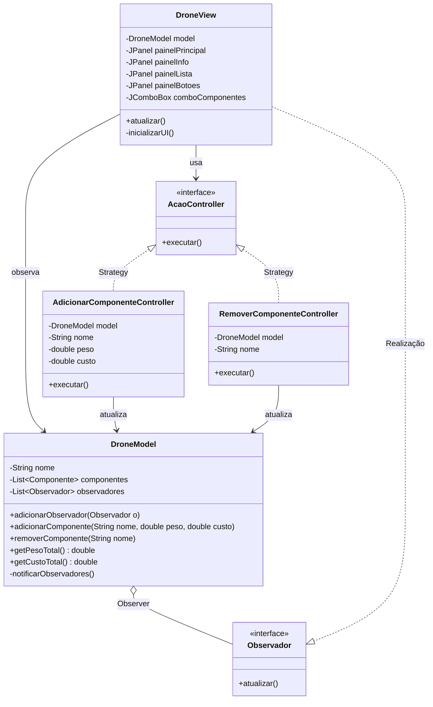

# MVC Desktop — Strategy + Observer + Composite

Este repositório contém um projeto acadêmico desenvolvido em Java com **Swing** que demonstra a aplicação do padrão arquitetural **MVC (Model-View-Controller)** integrando três padrões de projeto GoF: **Observer**, **Strategy** e **Composite**.

## 📌 Índice
* [1. O Cenário de Negócio](#1-o-cenário-de-negócio)
* [2. A Arquitetura MVC](#2-a-arquitetura-mvc)
* [3. Os Padrões Integrados](#3-os-padrões-integrados)
* [4. Visualização UML](#4-visualização-uml)
* [5. Como os Padrões se Conectam](#5-como-os-padrões-se-conectam)
* [6. Código Exemplo](#6-código-exemplo)
* [7. Como Executar](#7-como-executar)

---

## 1. O Cenário de Negócio
O projeto simula um **Gerenciador de Drones** desktop. O usuário pode selecionar componentes (`Motor`, `Sensor`, `Bateria`, `GPS`, `ActionCam`) e adicioná-los ou removê-los de um drone. O peso total e o custo de manutenção são recalculados e exibidos automaticamente a cada alteração — sem que a interface precise saber como o cálculo é feito.

---

## 2. A Arquitetura MVC

| Camada | Classe | Responsabilidade |
| :--- | :--- | :--- |
| **Model** | `DroneModel` | Guarda os dados do drone e notifica a View quando há mudanças |
| **View** | `DroneView` | Exibe os dados e captura ações do usuário |
| **Controller** | `AdicionarComponenteController` / `RemoverComponenteController` | Processa as ações e atualiza o Model |

---

## 3. Os Padrões Integrados

### 🔵 Observer — Model notifica a View
O `DroneModel` mantém uma lista de `Observador`. Sempre que um componente é adicionado ou removido, ele chama `notificarObservadores()`. A `DroneView` implementa `Observador` e se atualiza automaticamente — sem que o Controller precise acionar a View manualmente.

### 🟢 Strategy — Controllers como estratégias intercambiáveis
A interface `AcaoController` define o contrato para qualquer ação. `AdicionarComponenteController` e `RemoverComponenteController` são estratégias concretas. A View não sabe o que o Controller faz — apenas chama `executar()`.

### 🟡 Composite — Painéis Swing dentro de painéis
A `DroneView` é construída com painéis (`JPanel`) aninhados: `painelInfo`, `painelLista` e `painelBotoes` são agrupados dentro de `painelPrincipal`. Cada painel é tratado uniformemente pelo layout, sem distinção entre painel simples e composto.

---

## 4. Visualização UML



---

## 5. Como os Padrões se Conectam

```
Usuário clica em "Adicionar"
        │
        ▼
   DroneView (Composite — painéis Swing)
        │ cria e chama
        ▼
   AcaoController.executar() (Strategy)
        │ chama
        ▼
   DroneModel.adicionarComponente()
        │ chama
        ▼
   notificarObservadores() (Observer)
        │ chama
        ▼
   DroneView.atualizar() — tela se atualiza automaticamente
```

---

## 6. Código Exemplo

```java
// Model — sujeito do Observer
DroneModel model = new DroneModel("DJI Mavic");

// View — observadora do Model, construída com Composite (Swing)
DroneView view = new DroneView(model);
// view se registra automaticamente como observador do model

// Quando o usuário clica em "Adicionar":
// Strategy em ação — Controller executa a ação
AcaoController acao = new AdicionarComponenteController(model, "Motor", 0.8, 150.0);
acao.executar();
// Model notifica a View → View.atualizar() é chamado automaticamente
// Tela exibe: Motor | Peso: 0.8kg | Custo: R$150.0
//             Peso Total: 0,80 kg | Custo Total: R$ 150,00
```

---

## 7. Como Executar

> ⚠️ Todos os comandos devem ser executados na raiz da pasta `padroes`.

### Passo 1 — Compilar todos os arquivos
```powershell
javac -d out (Get-ChildItem -Recurse -Filter "*.java" | Select-Object -ExpandProperty FullName)
```

### Passo 2 — Executar
```powershell
java -cp out mvc.main.Principal
```
