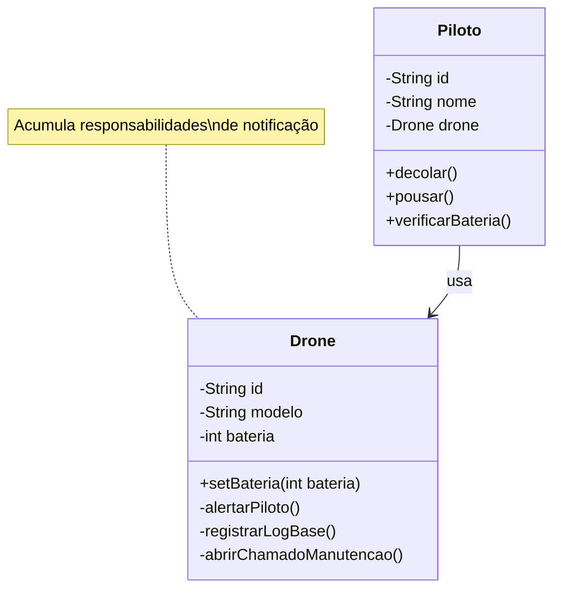
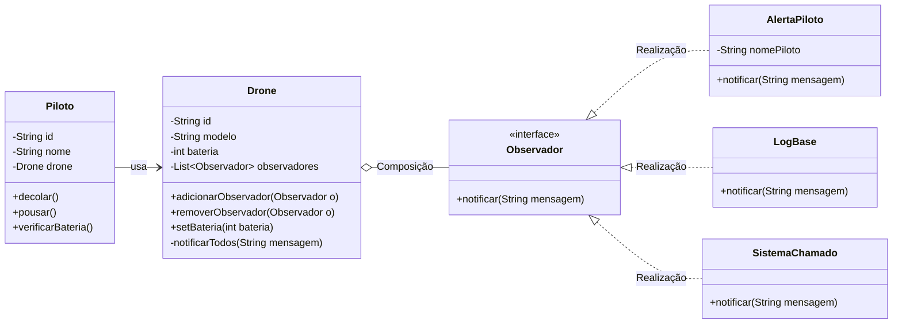

# Observer: Pattern and Anti-pattern

Este repositório contém um projeto acadêmico desenvolvido em Java para demonstrar, de forma prática e visual, a diferença entre o uso correto de um Padrão de Projeto (**Observer**) e a aplicação de um **Anti-padrão** (acoplamento direto entre objetos).

## 📌 Índice
* [1. O Cenário de Negócio](#1-o-cenário-de-negócio)
* [2. O Anti-padrão (Acoplamento Direto)](#2-o-anti-padrão-acoplamento-direto)
* [3. O Modelo Padrão (Observer Pattern)](#3-o-modelo-padrão-observer-pattern)
* [4. Visualização UML](#4-visualização-uml)
* [5. Principais Diferenças](#5-principais-diferenças)
* [6. Código Exemplo](#6-código-exemplo)
* [7. Como Executar](#7-como-executar)
* [📂 Ver código do Anti-padrão](./antipattern)
* [📂 Ver código do Padrão (Observer)](./pattern)

---

## 1. O Cenário de Negócio
O projeto simula um sistema de **monitoramento de drones**. Um `Drone` realiza missões controladas por um `Piloto`. Durante o voo, a bateria do drone é consumida. Quando o nível atinge um valor crítico, múltiplos sistemas precisam ser notificados: o piloto recebe um alerta, a base registra o evento em log e o sistema de manutenção abre um chamado automaticamente.

---

## 2. O Anti-padrão (Acoplamento Direto)
No modelo anti-padrão, o próprio `Drone` é responsável por notificar cada sistema diretamente. Ele possui métodos privados como `alertarPiloto()`, `registrarLogBase()` e `abrirChamadoManutencao()`, todos chamados dentro do `setBateria()`.

**O Problema:** O `Drone` acumula responsabilidades que não são dele. Ele precisa conhecer cada sistema de notificação individualmente. Se um novo sistema precisar ser adicionado — por exemplo, um alerta por e-mail — o programador precisará **modificar a classe `Drone`**, violando o princípio de design de software que diz que uma classe deve estar aberta para extensão, mas fechada para modificação (OCP do SOLID).

---

## 3. O Modelo Padrão (Observer Pattern)
Para resolver o acoplamento, extraímos a responsabilidade de notificação do `Drone` e a movemos para uma interface especializada chamada `Observador`.

**A Solução:** O `Drone` agora mantém uma **lista de observadores** e expõe métodos `adicionarObservador()` e `removerObservador()`. Quando a bateria cai, ele simplesmente chama `notificar()` em cada observador da lista — sem saber quem são. Cada observador concreto (`AlertaPiloto`, `LogBase`, `SistemaChamado`) decide o que fazer com a notificação.

---

## 4. Visualização UML

Abaixo estão os diagramas refletindo a estrutura do código.

### ❌ UML do Anti-padrão


### ✅ UML do Padrão Observer


---

## 5. Principais Diferenças

| Característica | ❌ Anti-padrão (Acoplamento Direto) | ✅ Padrão Observer (Composição) |
| :--- | :--- | :--- |
| **Acoplamento** | **Alto:** `Drone` conhece cada sistema diretamente. | **Baixo:** `Drone` só conhece a interface `Observador`. |
| **Extensibilidade** | **Baixa:** Adicionar novo sistema exige modificar o `Drone`. | **Alta:** Basta criar uma nova classe que implemente `Observador`. |
| **Responsabilidade** | **Violada:** `Drone` faz trabalho que não é dele. | **Respeitada:** Cada classe tem sua própria responsabilidade. |
| **Flexibilidade** | **Nula:** Observadores fixos no código do `Drone`. | **Total:** Observadores adicionados e removidos dinamicamente. |
| **SOLID** | Viola o *Open/Closed Principle* (OCP). | Segue o *Open/Closed Principle* (OCP). |

---

## 6. Código Exemplo

```java
// Criando o drone
Drone drone = new Drone("DR-01", "DJI200", 100);

// Registrando os observadores (Observer em ação)
drone.adicionarObservador(new AlertaPiloto("Carlos"));
drone.adicionarObservador(new LogBase());
drone.adicionarObservador(new SistemaChamado());

// Bateria cai para nível crítico — todos são notificados automaticamente
drone.setBateria(10);
// Saída:
// [ALERTA PILOTO - Carlos] Drone DR-01 com bateria crítica: 10%
// [LOG BASE] Drone DR-01 com bateria crítica: 10%
// [CHAMADO MANUTENÇÃO] Chamado aberto automaticamente: Drone DR-01 com bateria crítica: 10%

// Adicionar novo observador sem modificar o Drone
drone.adicionarObservador(new AlertaEmail()); // exemplo de extensão futura
```

---

## 7. Como Executar

> ⚠️ Todos os comandos devem ser executados na raiz da pasta `padroes`.

### Passo 1 — Compilar todos os arquivos
```powershell
javac -d out (Get-ChildItem -Recurse -Filter "*.java" | Select-Object -ExpandProperty FullName)
```

### Passo 2 — Executar

**❌ Antipadrão:**
```powershell
java -cp out observer.antipattern.main.Principal
```

**✅ Padrão (Observer):**
```powershell
java -cp out observer.pattern.main.Principal
```
