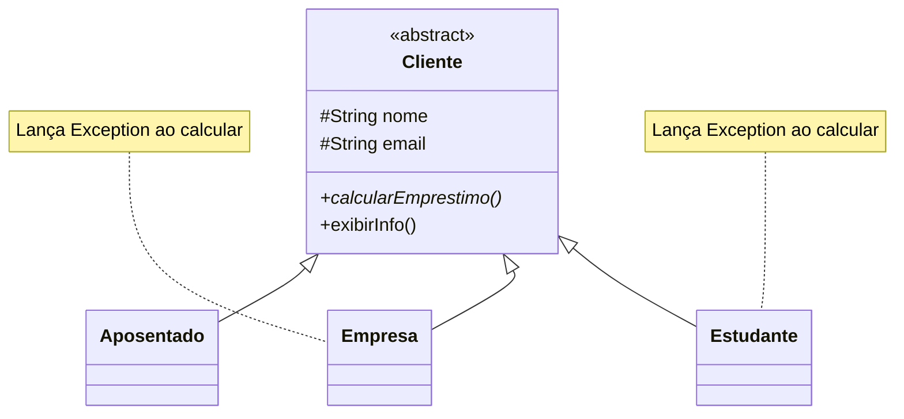
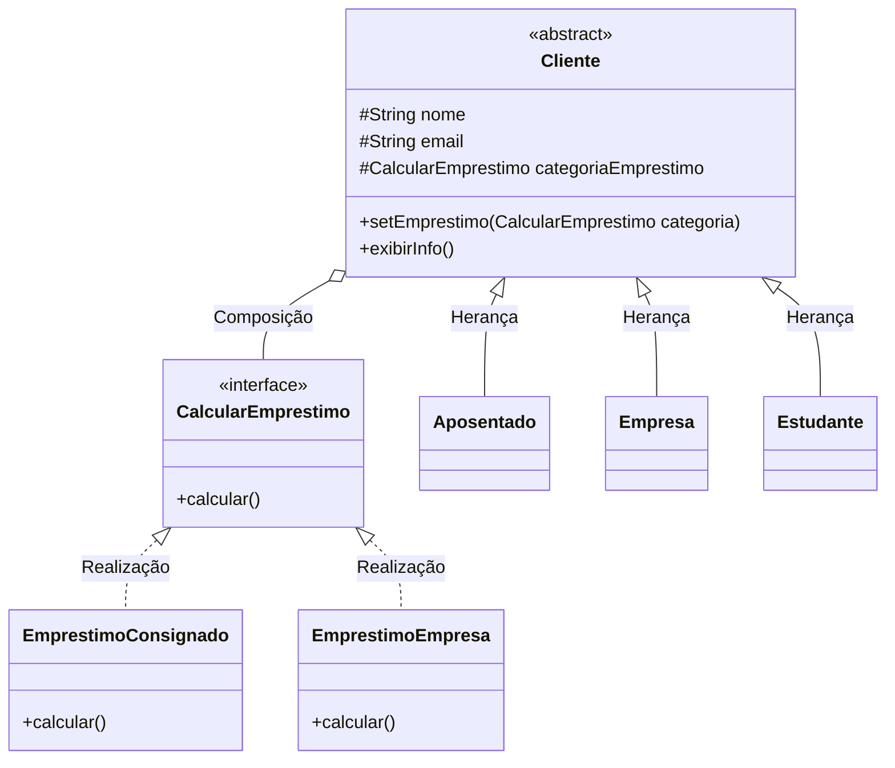

# Strategy: Pattern and Anti-pattern

Este repositório contém um projeto acadêmico desenvolvido em Java para demonstrar, de forma prática e visual, a diferença entre o uso correto de um Padrão de Projeto (**Strategy**) e a aplicação de um **Anti-padrão** (abuso de herança).

## 📌 Índice
* [1. O Cenário de Negócio](#1-o-cenário-de-negócio)
* [2. O Anti-padrão (Herança Rígida)](#2-o-anti-padrão-herança-rígida)
* [3. O Modelo Padrão (Strategy Pattern)](#3-o-modelo-padrão-strategy-pattern)
* [4. Visualização UML](#4-visualização-uml)
* [5. Principais Diferenças](#5-principais-diferenças)
* [6. Código Exemplo](#6-código-exemplo)
* [7. Como Executar](#7-como-executar)

---

## 1. O Cenário de Negócio
O projeto gerencia **Clientes** de um banco (Aposentados, Estudantes, Empresas) e suas regras para o **Cálculo de Empréstimos**. O objetivo é aplicar diferentes taxas e carências de acordo com o perfil do cliente, ou impedir o cálculo para perfis não elegíveis.

---

## 2. O Anti-padrão (Herança Rígida)
No modelo anti-padrão, o método `calcularEmprestimo()` foi inserido diretamente na classe abstrata `Cliente`. Isso forçou todas as subclasses a herdarem esse comportamento, mesmo que não precisassem.

**O Problema:** Subclasses como `Empresa` ou `Estudante` foram forçadas a herdar o método. A única "saída" do programador foi lançar uma exceção (`throw new Exception`), violando princípios de design de software (como o LSP do SOLID) e gerando erros em tempo de execução.

---

## 3. O Modelo Padrão (Strategy Pattern)
Para resolver o acoplamento, extraímos a lógica de cálculo da classe `Cliente` e a movemos para uma interface especializada chamada `CalcularEmprestimo`. 

**A Solução:** A classe `Cliente` agora usa **Composição**. Ela possui uma referência para a interface e um método `setEmprestimo()`. Isso permite "injetar" ou trocar a regra de cálculo de qualquer cliente dinamicamente, sem erros de execução e mantendo as subclasses limpas.

---

## 4. Visualização UML

Abaixo estão os diagramas gerados automaticamente refletindo a estrutura do código.

### ❌ UML do Anti-padrão


### ✅ UML do Padrão Strategy


---

## 5. Principais Diferenças

| Característica | ❌ Anti-padrão (Herança Rígida) | ✅ Padrão Strategy (Composição) |
| :--- | :--- | :--- |
| **Acoplamento** | **Alto:** A regra está presa na hierarquia. | **Baixo:** Regras isoladas em classes próprias. |
| **Extensibilidade** | **Baixa:** Exige alterar a classe pai e subclasses. | **Alta:** Basta criar uma nova classe de estratégia. |
| **Flexibilidade** | **Nula:** Comportamento fixo na criação. | **Total:** Comportamento trocado via `setEmprestimo()`. |
| **Segurança** | Depende de `try-catch` e lança Exceptions. | Baseado em contratos (Interfaces). |
| **SOLID** | Viola o *Liskov Substitution Principle* (LSP). | Segue o *Open/Closed Principle* (OCP). |

---

## 6. Código Exemplo

```java
// Instanciando subclasses de Cliente
Cliente joao = new Aposentado("João", "joao@email.com", "123", "Rua 1");
Cliente tech = new Empresa("Tech Corp", "tech@email.com", "456", "Rua 2");

// Injetando as estratégias (Strategy em ação)
joao.setEmprestimo(new EmprestimoConsignado());
// tech não recebe estratégia (não é elegível para empréstimo)

// Execução limpa e segura
joao.exibirInfo(); // Saída: Exibe infos + "Calculando empréstimo consignado..."
tech.exibirInfo(); // Saída: Exibe infos + "Status: Sem empréstimo disponível."
```

---

## 7. Como Executar

1. Certifique-se de ter o **Java JDK** instalado.
2. Navegue até o diretório correspondente (`strategy/padrao/main` ou `strategy/antipadrao/main`).
3. Compile e execute o arquivo principal (`Principal.java` ou `main.java`) pela sua IDE de preferência (VS Code, Eclipse, IntelliJ) ou via terminal.
