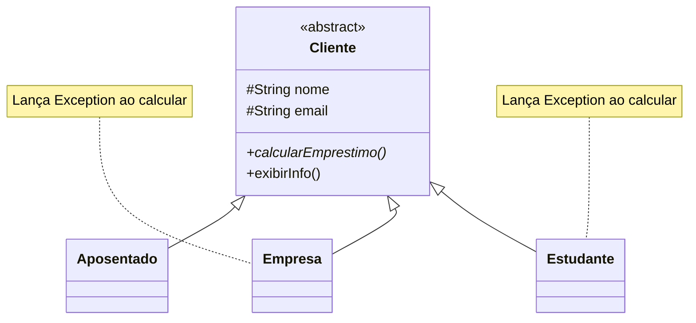
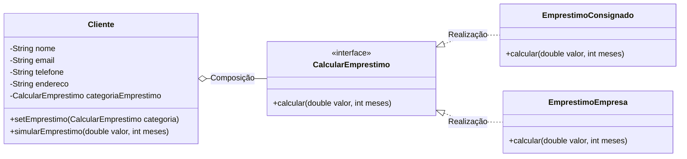

# Strategy: Pattern and Anti-pattern

Este repositório contém um projeto acadêmico desenvolvido em Java para demonstrar, de forma prática e visual, a diferença entre o uso correto de um Padrão de Projeto (**Strategy**) e a aplicação de um **Anti-padrão** (abuso de herança).

## 📌 Índice
* [1. O Cenário de Negócio](#1-o-cenário-de-negócio)
* [2. O Anti-padrão (Herança Rígida)](#2-o-anti-padrão-herança-rígida)
* [3. O Modelo Padrão (Strategy Pattern)](#3-o-modelo-padrão-strategy-pattern)
* [4. Visualização UML](#4-visualização-uml)
* [5. Principais Diferenças](#5-principais-diferenças)
* [6. Código Exemplo](#6-código-exemplo)
* [7. Como Executar](#7-como-executar)
* [📂 Ver código do Anti-padrão](./antipadrao)
* [📂 Ver código do Padrão (Strategy)](./padrao)

---

## 1. O Cenário de Negócio
O projeto gerencia **Clientes** de um banco e suas regras para o **Cálculo de Empréstimos**. O objetivo é aplicar diferentes taxas de acordo com o perfil do cliente (consignado, empresarial) ou indicar que não há crédito disponível — tudo isso sem precisar criar subclasses para cada tipo de cliente.

---

## 2. O Anti-padrão (Herança Rígida)
No modelo anti-padrão, o método `calcularEmprestimo()` foi inserido diretamente na classe abstrata `Cliente`. Isso forçou todas as subclasses a herdarem esse comportamento, mesmo que não precisassem.

**O Problema:** Subclasses como `Empresa` ou `Estudante` foram forçadas a herdar o método. A única "saída" do programador foi lançar uma exceção (`throw new Exception`), violando princípios de design de software (como o LSP do SOLID) e gerando erros em tempo de execução.

---

## 3. O Modelo Padrão (Strategy Pattern)
Para resolver o acoplamento, extraímos a lógica de cálculo da classe `Cliente` e a movemos para uma interface especializada chamada `CalcularEmprestimo`.

**A Solução:** A classe `Cliente` agora é **concreta** e usa **Composição**. Ela possui uma referência para a interface e um método `setEmprestimo()`. Isso permite "injetar" ou trocar a regra de cálculo de qualquer cliente dinamicamente — sem herança, sem subclasses, sem erros de execução.

---

## 4. Visualização UML

Abaixo estão os diagramas refletindo a estrutura do código.

### ❌ UML do Anti-padrão


### ✅ UML do Padrão Strategy


---

## 5. Principais Diferenças

| Característica | ❌ Anti-padrão (Herança Rígida) | ✅ Padrão Strategy (Composição) |
| :--- | :--- | :--- |
| **Estrutura** | Herança — subclasses para cada tipo de cliente. | Composição — um único `Cliente` concreto. |
| **Acoplamento** | **Alto:** A regra está presa na hierarquia. | **Baixo:** Regras isoladas em classes próprias. |
| **Extensibilidade** | **Baixa:** Exige criar nova subclasse para novo tipo. | **Alta:** Basta criar uma nova classe de estratégia. |
| **Flexibilidade** | **Nula:** Comportamento fixo na criação. | **Total:** Comportamento trocado via `setEmprestimo()`. |
| **Segurança** | Depende de `try-catch` e lança Exceptions. | Baseado em contratos (Interfaces). |
| **SOLID** | Viola o *Liskov Substitution Principle* (LSP). | Segue o *Open/Closed Principle* (OCP). |

---

## 6. Código Exemplo

```java
// Um único Cliente concreto — sem subclasses
Cliente joao = new Cliente("João", "joao@email.com", "11-9999", "Rua 1");
Cliente tech = new Cliente("Tech Corp", "tech@email.com", "11-8888", "Av. 2");
Cliente carlos = new Cliente("Carlos", "carlos@email.com", "11-7777", "Rua 3");

// Injetando as estratégias (Strategy em ação)
joao.setEmprestimo(new EmprestimoConsignado());
tech.setEmprestimo(new EmprestimoEmpresa());
// carlos não recebe estratégia — sem crédito disponível

// Execução limpa e segura
joao.simularEmprestimo(10000, 24);  // usa EmprestimoConsignado
tech.simularEmprestimo(10000, 24);  // usa EmprestimoEmpresa
carlos.simularEmprestimo(10000, 24); // exibe "Sem empréstimo disponível"

// Trocar estratégia em tempo de execução
joao.setEmprestimo(new EmprestimoEmpresa());
joao.simularEmprestimo(10000, 24); // agora usa EmprestimoEmpresa
```

---

## 7. Como Executar

> ⚠️ Todos os comandos devem ser executados na raiz da pasta `padroes`.

### Passo 1 — Compilar todos os arquivos
```powershell
javac -d out (Get-ChildItem -Recurse -Filter "*.java" | Select-Object -ExpandProperty FullName)
```

### Passo 2 — Executar

**❌ Antipadrão:**
```powershell
java -cp out strategy.antipadrao.main.java.com.aula1.Principal
```

**✅ Padrão (Strategy):**
```powershell
java -cp out strategy.padrao.main.Principal
```
